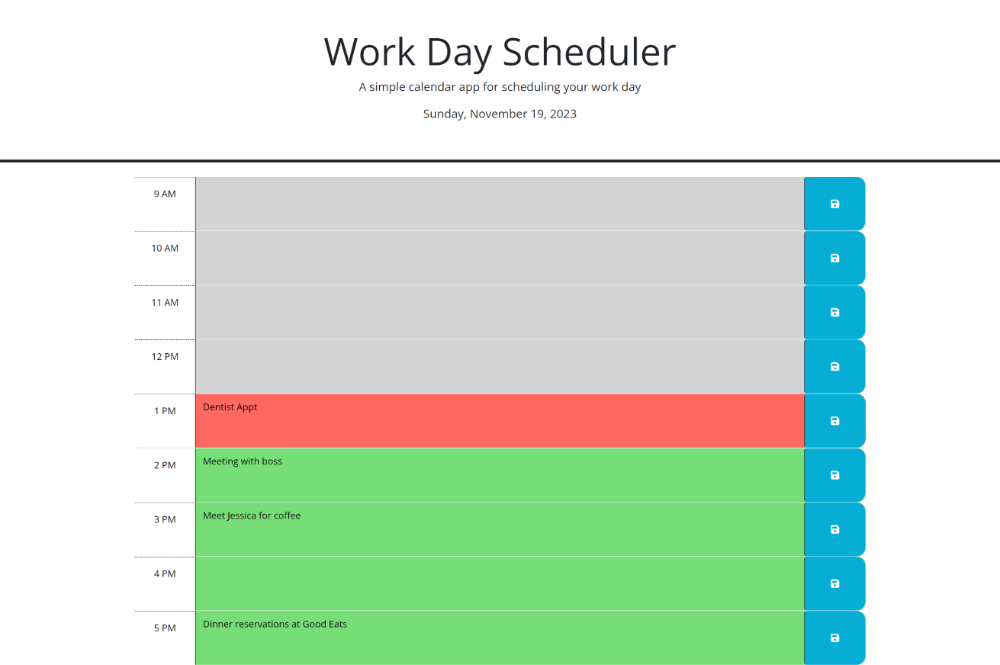

# Work-Day-Scheduler

## Description
Motivation
- The hustle of a busy work schedule can be overwhelming. The motivation behind the Work Day Scheduler is to provide employees with a simple yet effective tool to manage their time efficiently. This app aims to offer a user-friendly interface where users can seamlessly add, view, and organize their important events throughout the day.

Purpose
- The Work Day Scheduler serves the purpose of assisting employees in structuring their daily activities. It provides a clear and intuitive layout displaying the current day, color-coded time blocks for easy distinction between past, present, and future events, and the ability to add, edit, and save events for each specific time slot.

Problems
- The Work Day Scheduler addresses common challenges such as inefficient time management, lack of clear visual cues for scheduling, and the struggle to maintain persistent event storage across sessions.

Learnings
- Developing the Work Day Scheduler highlighted the importance of prioritizing user-centric design for enhanced user experience and the necessity of real-time updates for improved scheduling. Additionally, efficient management of local storage was crucial to ensure the persistence of users' scheduled events despite page refreshes.

## Screenshot

## Links
[Live URL](https://xtianhope.github.io/work-day-scheduler/)